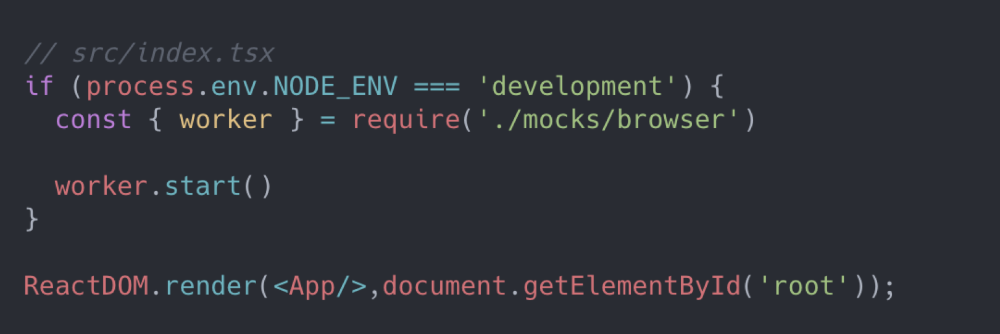

# [MSW](https://tech.kakao.com/2021/09/29/mocking-fe)

<br />
  
🔖 **`Mocking으로 생산성까지 챙기는 FE 개발`**

    ❗ 3줄 요약

\- API가 개발되기 전에 화면개발을 마치자 ( Mocking )

\- 기획 | 프론트엔드 | 백엔드 / 각 파트간 초기 커뮤니케이션을 통해 방향을 정하자

\- MSW를 사용해보자

<br />

    😃 블로그에서 기억하고 싶은 내용을 써보세요.

## [ 프론트엔드 개발 과정의 현실 ]

> 먼저 프론트엔드 개발을 하면서 겪게 되는 불편한 점에 대해서 말씀을 드려 보겠습니다.

    전체 개발 프로세스 중 요구 사항 분석 및 기획, 백엔드 개발, 프론트엔드 개발에 이르는 각각의 개발 과정은 크게 겹치지 않고 진행되는 것이 가장 이상적일것이다. 
    왜냐하면, 개발 과정에서 도출되는 요구 사항이나 사용 가능한 인터페이스에 변경이 있으면 각 단계별 의존성에 따라 다시 작업해야 하는 경우가 발생하기 때문입니다.

<br />

    이때 프론트엔드에서 백엔드의 API를 활용해야 하는 것처럼, 백엔드 개발에 종속적인 부분이 있다면
    해당 부분이 완성되기 전까지는 프론트엔드에서 개발을 진행할 수 없고 그 부분이 진행된 후에나 개발이 가능합니다. 
    심지어 추가적인 수정사항이 발생했는데 백엔드 개발에 의존성이 있는 부분에 수정이 필요하다면 이러한 비효율적인 과정을 반복 진행할 수밖에 없습니다.

---

## [ Mocking하기 ]

**`Mocking에 대하여`**

`Flow 1`

1. 기획자가 요구사항을 개발자에게 전달
2. 백엔드와 종속적인 개발 영역이 있는 경우 API 스펙을 사전에 공유
   2-1. API 문서를 사전에 제공받은 경우 사전 개발을 진행하게 되고
   API를 통해 실제로 연동할 때까지 큰 변화없이 진행이 가능하다.

<br />

`Flow 2`

1. 기획자가 요구사항을 개발자에게 전달
2. API 의존성을 가져가지 않고 Mocking을 통해 개발을 진행한 다음 API 연동

<br />

**`기존 Mocking 진행 방법`**

1. 화면에 필요한 데이터의 상태를 애플리케이션의 내부 로직에 직접 Mocking
   1-1. 구현이 쉬워 빠르게 적용이 가능하다.
   1-2. HTTP 메소드와 네트워크 응답 상태에 따라 대응하기 어렵다.

2. Mock Server 이용하기
   2-1. 웹 애플리케이션의 서비스 로직을 수정하지 않아도 된다.
   2-2. 데이터 상태 구현에는 공수가 상당히 들어간다.

<br />

**`실제 API를 사용하는 것처럼 네트워크 수준에서 Mocking 하기`**

`MSW.js`

\- [MSW](https://mswjs.io/)는 Mock Service Worker의 약자로 API Mocking 라이브러리 이다.

\- `MSW`를 이용하면 Mock 서버를 구축하지 않아도 API를 네트워크 수준에서 Mocking 할 수 있다.

<br />

**`Service Worker란?`**

    Service Worker는 웹 애플리케이션의 메인 스레드와 분리된 별도의 백그라운드 스레드에서 실행시킬 수 있는 기술 중 하나이다. Service Worker 덕분에 애플리케이션의 UI Block 없이 연산을 처리할 수 있다.

<br />

**`Service Worker가 제한되는 환경`**

    모든 브라우저에서 지원하고 있으나 IE와 같은 일반 브라우저에서는 지원하지 않는다.
    localhost가 아닌 환경이라면 HTTPS 보안 프로토콜 환경이 필요하다.

<br />

**`MSW 동작 원리`**

<p align="center">

</p>

<br />

**`MSW를 활용한 개발 방식`**

<p align="center">

</p>

<br />

**`MSW 사용방법`**

<p align="center">

</p>

```bash
yarn add -D msw
```

<br />

**`MSW handler`**

<p align="center">

</p>

<br />

**`MSW browser`**

<p align="center">

</p>

<br />

**`MSW Start`**

<p align="center">

</p>

<br />

**`MSW 동작 확인`**

`fetch(‘/api/products’)`

<p align="center">

</p>

<br />

<p align="center">

</p>

<br />

**`MSW Error Case`**

`fetch(‘/api/products?error_code=400’)`

<p align="center">

</p>

<br>

**`MSW Error Case 확인`**

`fetch(‘/api/products?error_code=400’)`

<p align="center">

</p>

<br>

<p align="center">

</p>

---
